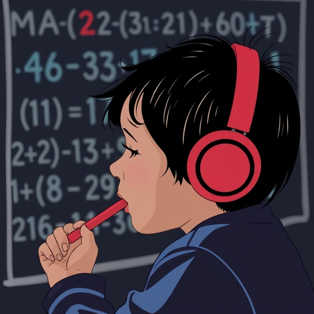
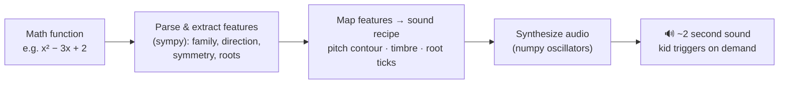

# 🔢🔊 Math Sonify ADHD O1 — hearing math, for ADHD KIDS -friendly learning

Author and credits : Mohamed Mortadha MANAI 

[](LICENSE)
[](https://www.python.org/)
[](#open-questions--how-to-help)
[](CONTRIBUTING.md)

> **Can a consistent sound help a primary-school kid with ADHD focus on and
> remember a math function?** This repo is a working prototype and an open
> question — not a validated learning tool. Try it, break it, test it with a
> real kid, and tell us what happened.

**🕹️ [Try the live demo](https://mortadhamannai.github.io/Math-Sonify-ADHD-O1/)**
— tap a function to hear it, then try the "which one was that?" practice
round in your browser. No install needed.




---

## Table of contents

- [Live demo](#-try-the-live-demo)
- [The idea](#the-idea)
- [Hear it](#hear-it)
- [Quickstart](#quickstart)
- [How it works](#how-it-works)
- [Supported functions](#currently-supported)
- [Open questions / how to help](#open-questions--how-to-help)
- [Why not just train an ML model](#why-deterministic-sound-design-instead-of-a-trained-ml-model)
- [Contributing](#contributing)
- [License](#license)

---

## The idea



- **Pitch contour traces the graph's shape.** A rising line sounds like a
  rising tone. A downward parabola sounds like rise-then-fall — the sound and
  the visual graph reinforce the *same* mental image.
- **Timbre encodes the function family**, always the same way: clean sine for
  linear, softer triangle for quadratic, gentle vibrato for periodic.
- **Root "ticks"** mark zero-crossings as short audible landmarks.
- **Short, predictable, on-demand** — ~2 seconds, kid-triggered, never
  auto-playing. Low sensory surprise on purpose.

## Hear it

| Function | Family | What to listen for |
|---|---|---|
| `2x + 3` | linear ↑ | steadily rising tone |
| `-x + 5` | linear ↓ | steadily falling tone |
| `x² - 3x + 2` | quadratic (valley) | dips then rises, two root-ticks |
| `-x² + 9` | quadratic (hill) | rises then dips, two root-ticks |
| `sin(x)` | periodic | gentle wavering pitch |

Generate all five yourself in under a minute — see Quickstart below.

## Quickstart

```bash
git clone https://github.com/<your-username>/math-sonify-adhd.git
cd math-sonify-adhd
python3 -m venv venv && source venv/bin/activate   # Windows: venv\Scripts\activate
pip install -r requirements.txt
cd src
python3 synthesize.py          # writes 5 example .wav files to ../examples/
python3 try_it.py "x**2 - 5*x + 6"    # try your own function
```

Play the generated `.wav` files with whatever's native to your OS
(`afplay` on macOS, `aplay` on Linux, just double-click on Windows).

## How it works

```
src/
  features.py       # parse a function string (sympy) → family / direction /
                     # symmetry / roots
  sound_mapping.py  # features → sound "recipe" (pitch contour, timbre,
                     # root-tick timing)
  synthesize.py     # recipe → real .wav (pure numpy oscillator synthesis,
                     # no external audio engine)
  try_it.py         # CLI: python3 try_it.py "<function>" [output.wav]
examples/           # generated sample sounds
docs/
  index.html        # the live browser demo (tap-to-hear + practice quiz),
                     # same rules reimplemented in JS/Web Audio, served via
                     # GitHub Pages
```

Each file's docstring explains the *design reasoning*, not just the code —
that's deliberate, since the sound-design choices matter more than the DSP.

## Currently supported

- ✅ Linear functions (`m·x + b`)
- ✅ Quadratic functions (`a·x² + b·x + c`)
- ✅ Basic periodic functions (`sin(x)`, `cos(x)`)
- ⚠️ Anything else falls back to a generic mapping — not yet carefully
  designed. Contributions welcome.

## Open questions / how to help

This needs critical ears and real classroom/at-home testing far more than it
needs more code:

- [ ] Is the pitch-contour mapping actually intuitive? (Blind test: can you
      guess "up" vs "down" from sound alone?)
- [ ] Are the three timbres distinct enough for a young child to tell apart?
- [ ] Has anyone tested this with an actual ADHD child, even informally —
      did it help, distract, or do nothing?
- [ ] Should root-ticks be a spoken cue instead of a click, for younger kids?
- [ ] Higher-degree polynomials, absolute value, and other common
      primary/middle-school functions need mapping rules.

**If you try this with a kid, a class, or just your own ears** — open an
Issue and tell us what happened. Negative results ("tried it, no effect on
focus") are just as useful as positive ones.

## Why deterministic sound design instead of a trained ML model

There's no dataset of "function → sound that helps ADHD kids remember it" —
that mapping doesn't exist yet, so there's nothing to train on. This repo
builds an explicit, hand-designed, fully explainable mapping first. Once real
usage data exists, a learned model that generalizes or personalizes the
mapping becomes a reasonable next step — jumping to ML now would just mean
training on invented labels.

## Contributing

See [CONTRIBUTING.md](CONTRIBUTING.md) — testing feedback is as welcome as
code.

## License

MIT — see [LICENSE](LICENSE). Use it, fork it, test it, improve it.

---

<sub>Built by Mohamed Mortadha Manai —
Generative AI Engineer, PhD candidate in Explainable AI, Google Developer Expert in Cloud AI, International AI Speaker.</sub>
